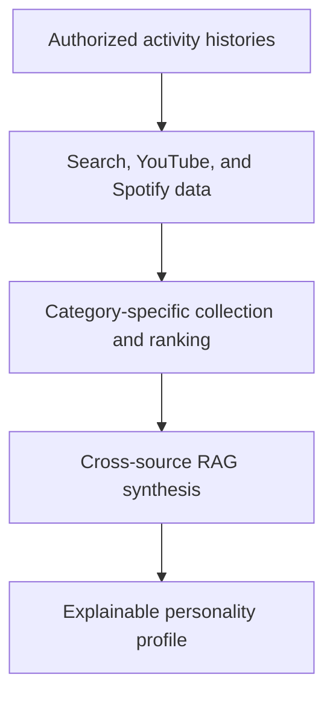

# AI Personality Profiler

**Hook 'Em Hacks 2026 | April 11, 2026**

An AI application that generates explainable personality profiles from user-authorized search, YouTube, and Spotify activity histories. The project uses a hierarchical retrieval-augmented generation pipeline to identify interests, recurring behaviors, and themes across multiple sources of digital activity.

## Project Overview

A person's online activity is distributed across platforms, making it difficult to understand broader patterns from any single source. This project combines activity histories from search, YouTube, and Spotify to construct a more complete behavioral profile.

Rather than treating every activity record equally, the application collects and ranks relevant signals within each data-source category before synthesizing them into structured interests and behavioral themes.

## Key Features

* Processes user-authorized digital activity histories
* Integrates search, YouTube, and Spotify data
* Organizes records into source-specific categories
* Ranks behavioral signals by relevance
* Uses hierarchical retrieval-augmented generation
* Identifies recurring interests and cross-platform patterns
* Produces an explainable personality profile

## How It Works

1. The user authorizes access to supported activity histories.
2. Activity records are collected and separated by source.
3. Relevant behavioral signals are identified and ranked within each category.
4. The hierarchical RAG pipeline compares signals across all three categories.
5. Recurring patterns are converted into structured interests and behavioral themes.
6. The application generates an explainable personality profile based on the synthesized information.

## Teo Kim's Contributions

* Helped build the AI personality-profiling application
* Designed the hierarchical RAG pipeline used to collect, rank, and synthesize behavioral signals
* Integrated activity information across search, YouTube, and Spotify data sources
* Converted fragmented activity records into structured interests and behavioral themes
* Helped develop the explainable profile-generation process

## Technologies and Concepts

* Retrieval-Augmented Generation
* Artificial Intelligence
* Data Integration
* Hierarchical Information Retrieval
* Behavioral-Signal Ranking
* Cross-Source Data Synthesis

## Demo

<!-- Add screenshots, a demo video, or a GIF of the application here. -->

## Privacy and Responsible Use

The project is designed around user-authorized activity histories. Digital activity can provide useful behavioral signals, but the generated profiles should be treated as interpretations rather than definitive psychological assessments.

## Contributors

* [Teo Kim](https://github.com/teotkim)
* Sambit Kanjilal
* Suchir Kumar
* Anish Mahambare

## Project Status

This project was developed as a collaborative hackathon prototype at Hook 'Em Hacks on April 11, 2026.

## Future Improvements

* Support additional user-authorized data sources
* Improve behavioral-signal ranking and filtering
* Add clearer evidence for each generated profile insight
* Strengthen privacy and consent controls
* Evaluate profile consistency across different activity histories
* Develop a more polished user-facing interface
